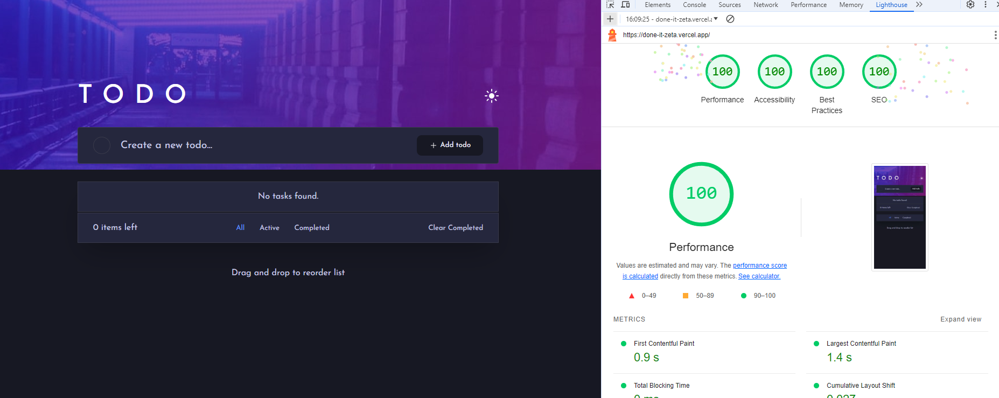

<h3 align="center"> ✅ DoneIT – Manage your tasks the smart way! </h3>

## Project Overview 🎨

**DoneIT** is a modern task management application designed to help users stay organized and productive.  
Reorder, edit, and delete tasks effortlessly – with additional confirmation for critical actions to ensure data safety.

✔️ **Minimal UI, powerful logic, built for productivity.**

---

## Tech Stack 🧰

| Tech | Description |
|------|-------------|
|  | Markup structure |
|  | Styling |
|  | Type-safe logic |
|  | Project bundler |
|  | IDE |
|  | Package manager |

---

## Libraries & Tools 📦

| Library | Purpose |
|---------|---------|
|  | Form validation |
| **SortableJS** | Drag & drop support |
| **QueryString** | URL filtering & state sync |
| **FocusTrap** | Accessibility – focus trap in modals |

---

## Features 🚀

- ✅ Light/dark theme with user preferences (Theme Provider)
- 📁 Persistent data via Local Storage (with strong typing)
- 🔍 Task filtering through URL parameters
- 🛠️ Full CRUD task operations
- 🧩 Modular modal system with confirmation prompts
- ♿ Accessibility via focus trapping
- 🎨 Clean, responsive, and intuitive UI/UX

---

## Installation & Setup 💻

```bash
# 1. Install dependencies
npm install

# 2. Start local development server
npm run dev

# 3. Open localhost URL in browser
```

## 👨‍💻 Developer Info
- 🐙 GitHub: https://www.github.com/ktcotz
- 💼 LinkedIn: https://www.linkedin.com/in/naskret-kamil/
- 🌐 Portfolio: https://kamil-me.vercel.app/
- 📫 Email: naskret.kamil@gmail.com
